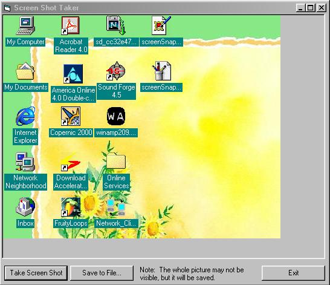



## Nice Screen Shot

### Description

Click and drag on the screen, and it makes a box that copies everything inside of it. Then you can save it, or take new shots. Great for taking pictures of your programs when listing them on PSC.
 
### More Info
 

             |
---                |---
**Submitted On**   |2000-06-13 13:20:56
**By**             |[Nick Smith](https://github.com/Planet-Source-Code/PSCIndex/blob/master/ByAuthor/nick-smith.md)
**Level**          |Intermediate
**User Rating**    |3.7 (11 globes from 3 users)
**Compatibility**  |VB 4\.0 \(16\-bit\), VB 4\.0 \(32\-bit\), VB 5\.0, VB 6\.0
**Category**       |[Custom Controls/ Forms/  Menus](https://github.com/Planet-Source-Code/PSCIndex/blob/master/ByCategory/custom-controls-forms-menus__1-4.md)
**World**          |[Visual Basic](https://github.com/Planet-Source-Code/PSCIndex/blob/master/ByWorld/visual-basic.md)
**Archive File**   |[CODE\_UPLOAD67026122000\.zip](https://github.com/Planet-Source-Code/nick-smith-nice-screen-shot__1-8861/archive/master.zip)

### API Declarations

see .bas file

